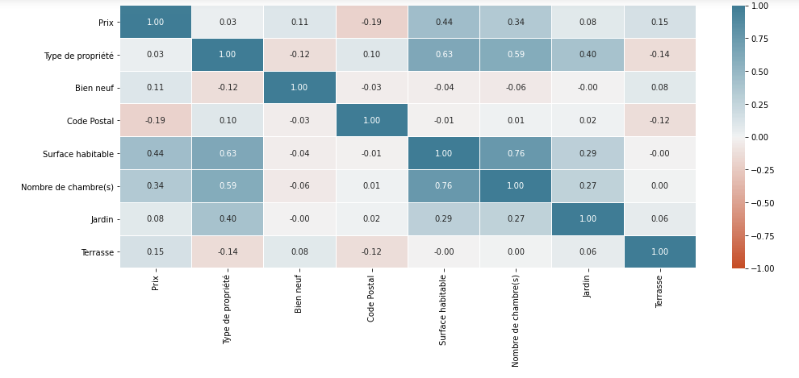
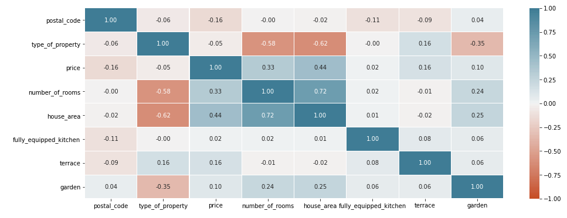

# ImmoEliza-API

API for ImmoEliza Project

Link to the challenge description :  [Here](https://github.com/becodeorg/CRL-Turing-4.22/blob/master/Projects/4.Prediction_api/README.md)

## Step to realise

### 1. Data cleaning

Normally, the first step would be to take a cleaned dataset and iron it to match our needs.  

But we preferred to start again from the uncleaned dataset to redo the cleaning from the beginning, this time directly for our prediction model.  
Since there are two usable raw datasets, we are going to exchange our data with another group and choose the most optimized one for our project.

We must therefore recover and clean the previously scrapped "ImmoCollect" dataset and compare its values with those of our colleague to then choose the most reliable one for our predictions.

### 2. Prediction model

Using the cleaned data it will be necessary to create a price prediction model based on the relevant features.
### 3. Making API

I will certainly start from the challenge-flask-api to initialize the API it will only remain to link it to our prediction model.

### 4. Deployment

For the deployment of the API I'm thinking of using a VPS and the docker service to make things easier but azure is still an option.

## Realisation

### 1. Data cleaning

After recovering and cleaning the different dataset we were able to compare them.  

#### First dataset "ImmoCollect18"
 
Input : 18 0000 row  
Output : 11 000 row  

No missing values !  
More info and heatmap BY type of property [Here](data-cleaning-IC18.ipynb)

```
Prix                    int64
Type de propriété       int64
Bien neuf                bool
Code Postal             int64
Surface habitable       int64
Nombre de chambre(s)    int64
Jardin                   bool
Terrasse                 bool
```

Heatmap (correlation) 



#### Second dataset "ImmoCollect52"
 
Input : 52 0000 row  
Output : 30 000 row  

No missing values !  
More info and heatmap BY type of property [Here](data-cleaning-IC52.ipynb)

```
postal_code                 int64
type_of_property            int64
price                       int64
number_of_rooms             int64
house_area                  int64
fully_equipped_kitchen      int64
terrace                     int64
garden                      int64
state_of_the_building       int64
```

PLUS (extended informations)

```
longitude                 float64
latitude                  float64
locality_km2              float64
locality                   object
province                   object
region                     object
head_city                  object
CD_REFNIS                 float64
living_surface_ha         float64
population                float64
pop_per_km2               float64
total_per_build_km2       float64
ratio_free_build          float64
```

Heatmap (correlation) 



### 2. Prediction model

The first dataset has better correlation while the second has more input and more extended info.

So I'm going to test different models on both datasets in parallel.