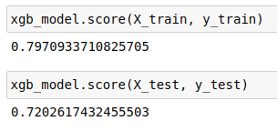
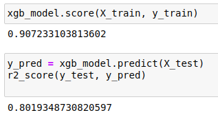

# ImmoEliza-API

API for ImmoEliza Project

Link to the challenge description :  [Here](https://github.com/becodeorg/CRL-Turing-4.22/blob/master/Projects/4.Prediction_api/README.md)

## Objective
This project is a collaboration between BeCode AI and the BeCode Web Dev team.

The AI developers will create an API and the web developers will develop an interface for the client "ImmoEliza".

The main process is about a collaboration between the AI and the web dev so that all have to be in sync in order to know how to construct the form.

- Be able to create a prediction model
- Be able to deploy model
- Be able to work in a team
- Be able to build an api

## Result

API : http://tamikara.xyz:5000/  
App : http://tamikara.xyz/immo-eliza/prediction/

## Step to realise

### 1. Data cleaning

Normally, the first step would be to take a cleaned dataset and iron it to match our needs.  

But we preferred to start again from the uncleaned dataset to redo the cleaning from the beginning, this time directly for our prediction model.  
Since there are two usable raw datasets, we are going to exchange our data with another group and choose the most optimized one for our project.

We must therefore recover and clean the previously scrapped "ImmoCollect" dataset and compare its values with those of our colleague to then choose the most reliable one for our predictions.

### 2. Prediction model

Using the cleaned data it will be necessary to create a price prediction model based on the relevant features.
### 3. Making API

I will certainly start from the challenge-flask-api to initialize the API it will only remain to link it to our prediction model.

### 4. Deployment

For the deployment of the API I'm thinking of using a VPS and the docker service to make things easier but azure is still an option.

## Realisation

### 1. Data cleaning

After recovering and cleaning the different dataset we were able to compare them.  

#### First dataset "ImmoCollect18"
 
Input : 18 0000 row  
Output : 11 000 row  

No missing values !  
More info and heatmap BY type of property [Here](data-cleaning-IC18.ipynb)

```
price                int64
type_of_property     int64
is_new                bool
postal_code          int64
house_area           int64
number_of_bedroom    int64
garden                bool
terrace               bool
```

Heatmap (correlation) 


#### Second dataset "ImmoCollect52"
 
Input : 52 0000 row  
Output : 40 000 row  

No missing values !  
More info and heatmap for [House](data-cleaning-IC52house.ipynb)  
More info and heatmap for [Apartment](data-cleaning-IC52apart.ipynb)  

```
postal_code                 int64
price                       int64
number_of_bedroom           int64
house_area                  int64
fully_equipped_kitchen      int64
terrace                     int64
garden                      int64
number_of_facades           int64
swimming_pool               int64
is_new                      int64
```

PLUS (extended informations)

```
locality                   object
district                   object
province                   object
province_int              float64
region                     object
region_int                float64
district_int              float64
ratio_free_build          float64
```

Heatmap (correlation) 


### 2. Prediction model

The first dataset has better correlation while the second has more input and more extended info.

_So I'm going to test different models on both datasets in parallel._

After a lot of testing and an aberrant lack of time, I chose to use only the "model52" for the continuation of the hostilities.

After dividing my dataset in two I get a **score of 72** for house predictions against **score of 80** for apartment predictions using **XGBOOST** algorythme

__House__ (Modeling House [Notebook](model52house.ipynb))    


__Apart__ (Modeling apartment [Notebook](model52apart.ipynb))  


It's not perfect but I have very little overfitting

### 3. Making API

To create the API I started from my challenge-flask-api.   
http://tamikara.xyz:5000/status

```json
{
  "server_status": "Alive!"
}
```

Then I'm going to create a "predict" route with "POST" method.  
I'll send back the requested information.

- Method : POST
- URL : /predict/

### 4. Deployment

I deployed everything on my VPS via docker

The API : http://tamikara.xyz:5000/  
The App : http://tamikara.xyz/immo-eliza/prediction/

You can also test my API from docker(hub) using this command :

```Docker
docker run -p 5000:5000 leersma/immoeliza-api:latest
```
